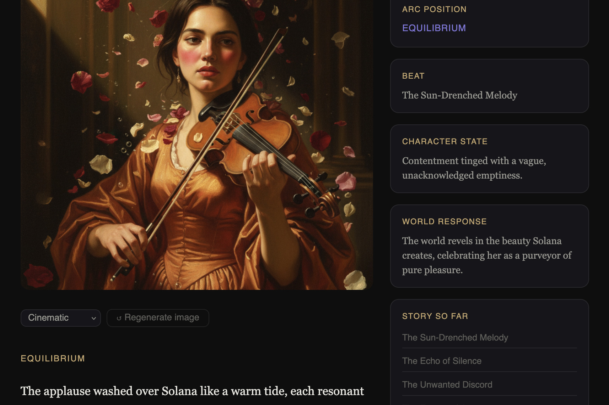

# Story Engine — Narrator

> *The constraint is the creativity.*



**[Try it live →](https://story-engine-mnplagomia-uc.a.run.app)**  &nbsp;|&nbsp; Built for the [Gemini Live Agent Challenge](https://geminiliveagentchallenge.devpost.com)

---

## What it is

Story Engine is a multi-agent AI system that constructs stories the way writers actually construct them — not as a single prompt fired at a language model, but as a layered process where each decision constrains and enriches the next.

Most AI story tools produce generic output because they give the model infinite degrees of freedom. Story Engine does the opposite. Six specialized agents work in sequence, each narrowing the creative space so the next agent can work with precision rather than guesswork. The result feels crafted rather than generated.

You can start with a single sentence. A feeling. An image. Or you can define a character from the inside out — their wound, their values, the world that resists them — and watch the story emerge from who they are.

---

## The philosophy

Every compelling story runs on the same engine: a character with an intolerable gap between where they are and where they need to be, in a world that pushes back. The plot is what happens when that pressure is applied. The prose is how it is felt.

Story Engine encodes this understanding into its architecture. The agents do not just generate — they reason about psychology, dramatic structure, world logic, and emotional register. They know that a false peak is not just a reversal but a win that activates a deeper form of the original pain. They know that the sidebar properties shown next to each scene — arc position, character state, world response — are not metadata. They are the generative brief the agents used to write that scene.

The user is not a passenger. They drive. The agents pave the road.

---

## The pipeline

```
User input  →  text / voice / image
      ↓
Constitution agent     extracts story identity, theme, emotional signature,
                       protagonist psychology, world contract, narration voice
      ↓
Possibility agent      finds dramatic collision points between character and world
                       proposes three genuinely distinct arc directions
      ↓
User chooses an arc
      ↓
Skeleton agent         generates 6 dramatic beats:
                       equilibrium → disruption → escalation →
                       false peak → crisis → transformation
      ↓
Per beat × 6:
  Scene agent          writes literary prose with craft and specificity
  Image prompt agent   generates a consistent visual brief referencing
                       previous scenes for character and world continuity
  Image agent          generates scene illustration via Gemini 2.5 Flash Image
                       in one of 8 art styles: Cinematic, Renaissance, Anime,
                       Watercolor, Noir, Fantasy, Minimal, Cubism
  Narrator             Web Speech API with voice parameters matched to the
                       story's emotional signature
      ↓
User can intervene at any beat — the agents rewrite from that point
while maintaining the story's identity, tone, and psychological coherence
```

---

## Two ways to begin

**Seed-first** — start with a premise, feeling, or image. The constitution agent expands outward, inferring character psychology, world logic, and dramatic potential from your seed. You discover who lives in the story.

> *"A blind cartographer who has spent her life drawing maps of places she has never seen."*

**Character-first** — define the character from the inside. Give them a name and a core gap — the wound or hunger that makes their current situation intolerable. Everything else can be left for the agents to infer, or specified in as much detail as you want. The story emerges from who they are, not from a plot imposed on them.

> Name: Sara  
> Core gap: She can never truly experience presence — she always documents instead of lives

In both modes, the pipeline is identical once the constitution exists. The difference is the direction of inference: expansion from a seed, or synthesis from a psychology.

---

## Multimodal features

- **Voice input** — speak your seed or intervention. Gemini transcribes and understands it.
- **Image seed** — upload any photograph. Gemini analyzes visual composition, mood, and implied narrative to extract a complete story constitution.
- **Generated illustrations** — every scene gets an AI-generated image in your chosen art style, maintained consistently across the story.
- **Narration** — each scene is read aloud in a voice style matched to the story's emotional signature.
- **Regenerate** — any scene image can be regenerated with a different art style without losing the story.

---

## Architecture

The system was designed from narrative theory first — working through story structure, character psychology, dramatic arc, world-building, and style as distinct conceptual layers before a single line of code was written. Each layer became an agent.

The **constitution** is the north star every agent checks against. Without it, each scene drifts toward generic output. With it, the scene agent knows the emotional signature. The image agent knows the tone. The narrator knows the register.

The **hierarchical generation** (constitution → possibilities → skeleton → scenes) means each agent works with increasing specificity. The scene agent is not generating a story — it is executing a precisely specified beat within a known arc within a known emotional signature. The constraint is the creativity.

---

## Quick start

```bash
git clone https://github.com/amingh802001/Narrator
cd Narrator
cp .env.example .env
# add your GEMINI_API_KEY to .env
./setup.sh
source .venv/bin/activate
uvicorn backend.main:app --reload --port 8080
```

Open `http://localhost:8080`

## Deploy to Google Cloud Run

```bash
./deploy.sh YOUR_GCP_PROJECT_ID YOUR_GEMINI_API_KEY
```

The `deploy.sh` script enables required APIs, builds and pushes the Docker image via Cloud Build, and deploys to Cloud Run with auto-scaling. The `cloudbuild.yaml` provides an alternative CI/CD path.

---

## Built with

- **Gemini 2.5 Flash** — all text generation agents
- **Gemini 2.5 Flash Image** — scene illustration generation
- **Google GenAI SDK** — all Gemini API calls
- **Google Cloud Run** — containerized backend, auto-scaling
- **FastAPI** — backend API framework
- **Web Speech API** — narration and voice input
- **Docker** — containerization

---

## What's next

The full theoretical architecture includes evaluation agents for consistency, structure, and quality; a critic/judge agent for comparative dramatic judgment; a psychological interpreter that maintains living character portraits; a contradiction agent that surfaces productive character complexity; a reader awareness agent grounded in narrative transportation theory; and a branching tree structure for non-linear story exploration.

The agents were deliberately separated by concern. A consistency check is not a quality evaluation. A quality evaluation is not a dramatic judgment. Each requires different context, different scope, and different repair strategies. The current pipeline is the load-bearing core. The rest is already designed.

---

*Built for the Gemini Live Agent Challenge — March 2026*  
*"The user drives. The agents pave the road."*

